# [pyDNTNK: Python Distributed Non Negative Tensor Networks](https://github.com/lanl/pyDNTNK)


<div align="center", style="font-size: 50px">

[](https://github.com/lanl/pyDNTNK/actions/workflows/ci_test.yml/badge.svg?branch=main) [](https://img.shields.io/badge/License-BSD%203--Clause-blue.svg) [](https://img.shields.io/badge/python-v3.7.1-blue) [](https://doi.org/10.5281/zenodo.4722448)

</div>

<br>

[pyDNTNK](https://github.com/lanl/pyDNTNK) is a software package for applying non-negative Hierarchical Tensor decompositions such as Tensor train and Hierarchical Tucker decompositons  in a distributed fashion to large datasets.
It is built on top of [pyDNMFk](https://github.com/lanl/pyDNMFk). Tensor train (TT) and Hierarchical Tucker(HT) are state-of-the-art tensor network introduced for factorization of high-dimensional tensors. These methods transform the initial high-dimensional tensor in a network of low dimensional tensors that requires only a linear storage. Many real-world data,such as, density, temperature, population, probability, etc., are non-negative and for an easy interpretation, the algorithms preserving non-negativity are preferred. Here, we introduce the  distributed non-negative Hierarchical tensor decomposition tools and demonstrate their scalability and the compression on synthetic and real world big datasets.
<hr/>


## Features:

* Utilization of MPI4py for distributed operation.
* Distributed Reshaping and Unfolding operations with zarr and Dask.
* Distributed Hierarchical Tensor decompositions such as Tensor train and Hierarchical Tucker.
* Ability to perform both standard SVD based and NMF based decompositions. 
* Scalability to Tensors of very high dimensions.
* Automated rank estimation with SVD for each stage of tensor decomposition.
* Distributed Pruning of zero row and zero columns of the data. 


**Figure:Overview of the distributed Tensor Train  implementation.**

## Installation:

On a desktop machine
```
git clone https://github.com/lanl/pyDNTNK.git
cd pyDNTNK
conda create --name pyDNTNK python=3.7.1 openmpi mpi4py
source activate pyDNTNK
python setup.py install
```

<hr/>

On a server
```
git clone https://github.com/lanl/pyDNTNK.git
cd pyDNTNK
conda create --name pyDNTNK python=3.7.1 
source activate pyDNTNK
module load <openmpi>
pip install mpi4py
python setup.py install
```

## Prerequisites:
* pyDNMFk
* conda
* numpy>=1.2
* matplotlib
* MPI4py
* scipy
* h5py
* dask
* zarr

## Documentation

You can find the documentation [here](https://lanl.github.io/pyDNTNK/). 


## Usage
```bash
mpirun -n <procs> python main.py usage: main.py [-h] [--p_grid P_GRID [P_GRID ...]] [--fpath FPATH]
               [--model MODEL] [--routine ROUTINE] [--init INIT] [--itr ITR]
               [--norm NORM] [--method METHOD] [--verbose VERBOSE]
               [--results_path RESULTS_PATH] [--prune PRUNE]
               [--precision PRECISION] [--err ERR] [--ranks RANKS [RANKS ...]]
               [--save SAVE]

Arguments for pyNTNK

optional arguments:
  -h, --help            show this help message and exit
  --p_grid P_GRID [P_GRID ...]
                        Processor Grid
  --fpath FPATH         data path to read(eg: ../data/array.zarr)
  --model MODEL         TN model (TT/TK) for tensor train/Tucker models
  --routine ROUTINE     NMF for nTT/nTK and SVD for TT/TK
  --init INIT           NMF initializations: rand/nnsvd
  --itr ITR             NMF iterations, default:1000
  --norm NORM           Reconstruction Norm for NMF to optimize:KL/FRO
  --method METHOD       NMF update method:MU/BCD/HALS
  --verbose VERBOSE
  --results_path RESULTS_PATH
                        Path for saving results
  --prune PRUNE         Prune zero row/column.
  --precision PRECISION
                        Precision of the data(float32/float64/float16.
  --err ERR             Error for rank estimation at each stage
  --ranks RANKS [RANKS ...]
                        Ranks for each stage of decomposition
  --save SAVE           Store TN factors

```

We provide a sample dataset that can be used for estimation of k:
```python
'''Imports block'''
import os
import sys
os.environ["OMP_NUM_THREADS"] = "1"
from pyDNTNK import pyDNTNK
from pyDNTNK import *
from pyDNMFk.utils import *
from pyDNMFk.dist_comm import *
args = parse()

'''parameters initialization block'''
args.fpath = '../data/array.zarr'
args.p_grid = [2,1,1,1]
args.tt_ranks = [2,2,2,2]
args.model,args.routine = 'tt','nmf'

'''Parameters prep block'''
main_comm = MPI.COMM_WORLD
rank = main_comm.rank
size = main_comm.size
args.p_r, args.p_c = 1, size
comm = MPI_comm(main_comm, args.p_r, args.p_c)
args.rank = rank
args.main_comm = main_comm
args.comm1 = comm.comm
args.comm = comm
args.col_comm = comm.cart_1d_column()
args.row_comm = comm.cart_1d_row()

'''Computations go here'''
if main_comm.rank == 0: print('Starting ', args.model, ' Tensor Decomposition with ', args.routine)
tt = pyDNTNK(args.fpath, args, model=args.model)
tt.fit()
tt.error_compute()
factors = tt.return_factors()
assert len(factors)==4
assert([i<1e-2 for i in tt.rel_error])
```

Alternately, you can also run from test folder in command line as:
```bash
mpirun -n 2 python main.py   --fpath '../data/array.zarr'  --model 'tt' --routine 'nmf' --p_grid 2 1 1 1 --tt_ranks 2 2 2 2
```

See the resources for more use cases.
<hr/>

## Benchmarking

Strong scaling (Overall)           |  Strong scaling (NMF) | Strong Scaling (Data Operations)
:-------------------------:|:-------------------------:|:-------------------------:
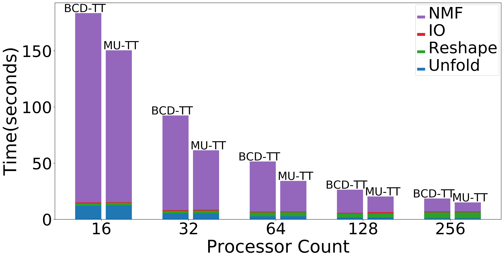  |  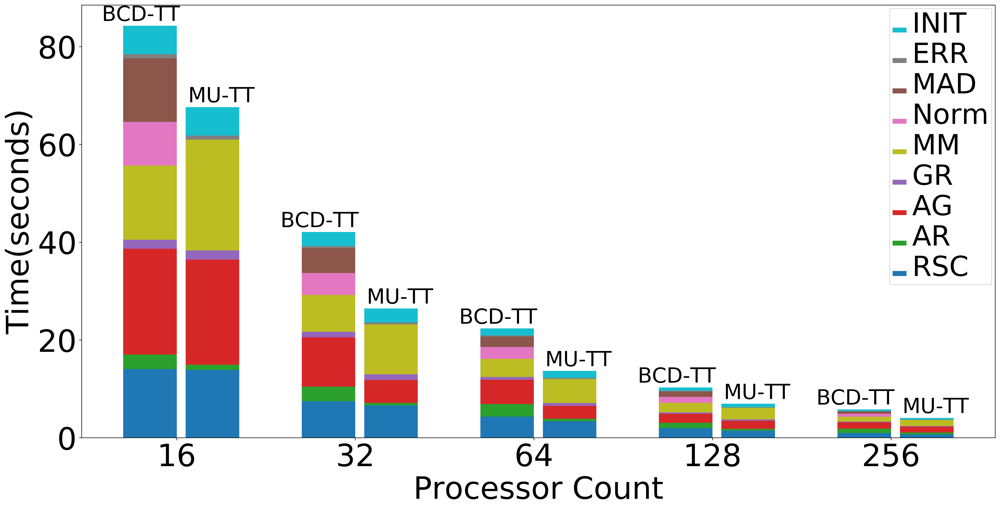 |  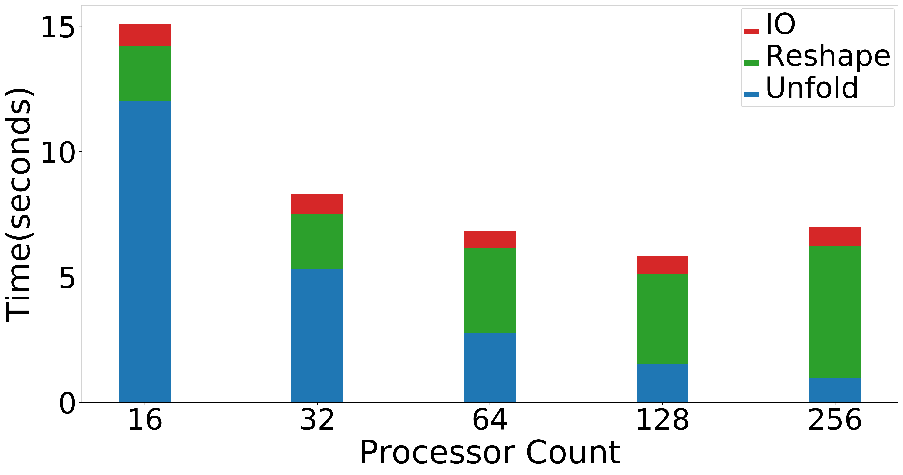 

Weak scaling (Overall)         |  Weak scaling (NMF) | Weak scaling (Data Operations)
:-------------------------:|:-------------------------:|:-------------------------:
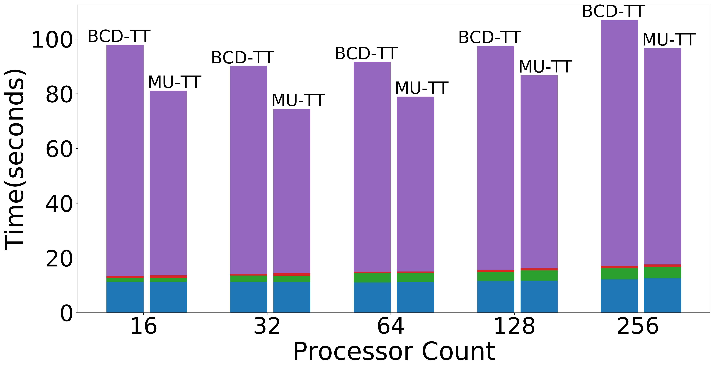  |  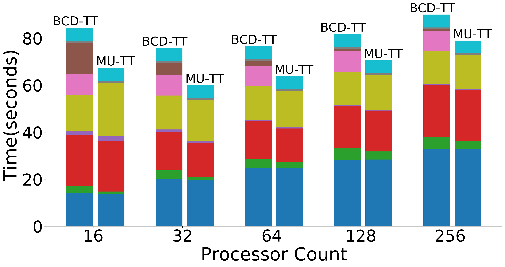 |  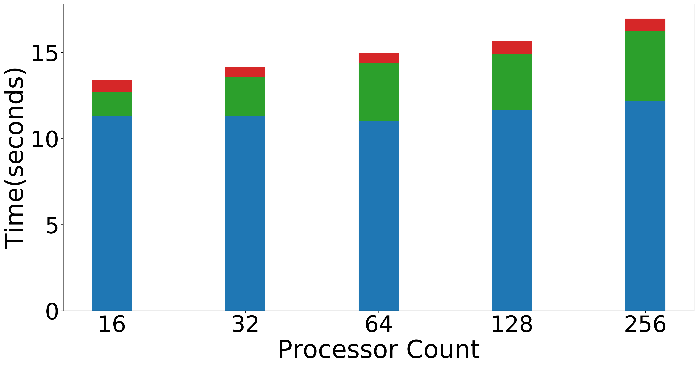 

Scaling with TT-ranks (Overall)          |  Scaling with TT-ranks (NMF) | Scaling with TT-ranks (Data Operations)
:-------------------------:|:-------------------------:|:-------------------------:
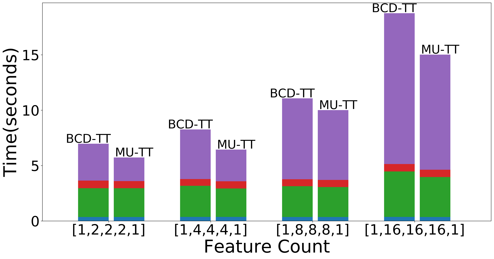  |  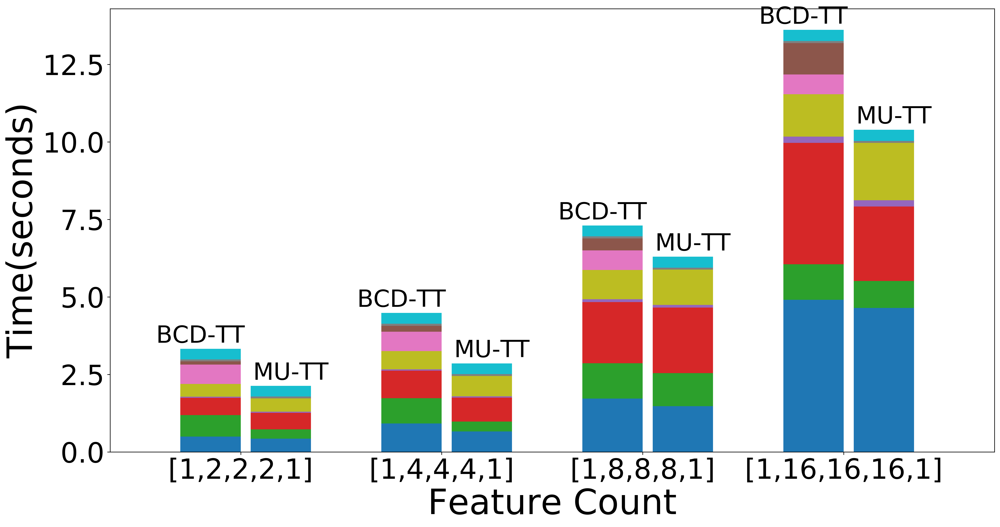 |  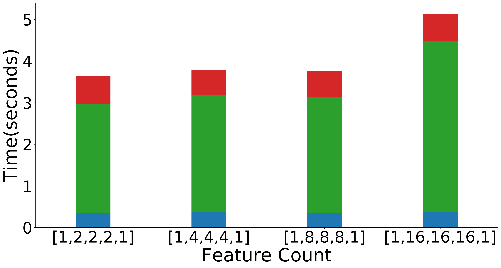 

**Figure: Scaling experiments for Tensor Train Decomposition.** 

## Scalability

Yale Face         |  Video dataset | Synthetic data(500GB)
:-------------------------:|:-------------------------:|:-------------------------:
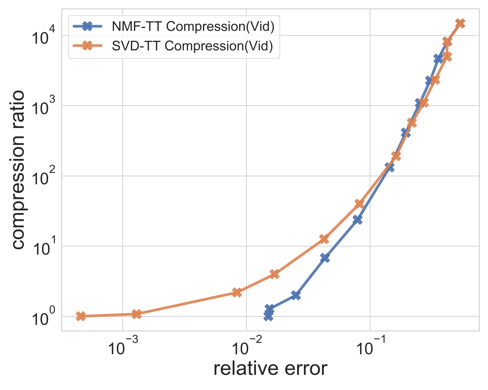  |   |  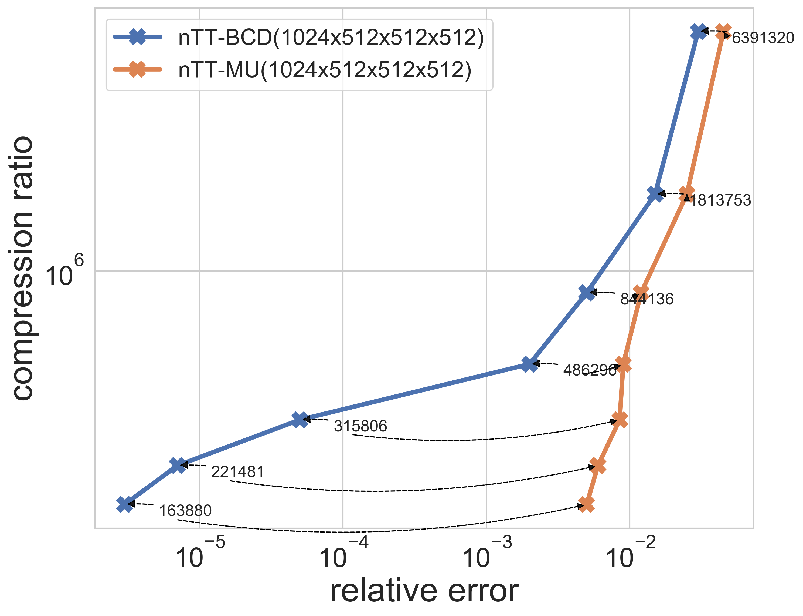 

## Authors:

* [Manish Bhattarai](mailto:ceodspspectrum@lanl.gov) - Los Alamos National Laboratory
* [Erik Skau](mailto:ewskau@lanl.gov) - Los Alamos National Laboratory
* [Phan Minh Duc Truong](mailto:dptruong@lanl.gov) - Los Alamos National Laboratory
* [Maksim E. Eren](mailto:maksim@lanl.gov) - Los Alamos National Laboratory
* [Namita Kharat](mailto:namita@lanl.gov) - Los Alamos National Laboratory
* [Gopinath Chennupati](mailto:gchennupati@lanl.gov) - Los Alamos National Laboratory
* [Raviteja Vangara](mailto:rvangara@lanl.gov) - Los Alamos National Laboratory
* [Hristo Djidjev](mailto:djidjev@lanl.gov) - Los Alamos National Laboratory
* [Boian Alexandrov](mailto:boian@lanl.gov) - Los Alamos National Laboratory

## Citation:

```latex
@misc{rw2019timm,
  author = {Manish Bhattarai,Ben Nebgen,Erik Skau,Maksim Eren,Gopinath Chennupati,Raviteja Vangara,Hristo Djidjev,John Patchett,Jim Ahrens,Boian ALexandrov},
  title = {pyDNMFk: Python Distributed Non Negative Matrix Factorization},
  year = {2021},
  publisher = {GitHub},
  journal = {GitHub repository},
  doi = {10.5281/zenodo.4722448},
  howpublished = {\url{https://github.com/lanl/pyDNMFk}}
}

@inproceedings{bhattarai2020distributed,
  title={Distributed Non-Negative Tensor Train Decomposition},
  author={Bhattarai, Manish and Chennupati, Gopinath and Skau, Erik and Vangara, Raviteja and Djidjev, Hristo and Alexandrov, Boian S},
  booktitle={2020 IEEE High Performance Extreme Computing Conference (HPEC)},
  pages={1--10},
  year={2020},
  organization={IEEE}
}

@inproceedings {s.20211055,
  booktitle = {EuroVis 2021 - Short Papers},
  editor = {Agus, Marco and Garth, Christoph and Kerren, Andreas},
  title = {{Selection of Optimal Salient Time Steps by Non-negative Tucker Tensor Decomposition}},
  author = {Pulido, Jesus and Patchett, John and Bhattarai, Manish and Alexandrov, Boian and Ahrens, James},
  year = {2021},
  publisher = {The Eurographics Association},
  ISBN = {978-3-03868-143-4},
  DOI = {10.2312/evs.20211055}
}

```

## Acknowledgments:
Los Alamos National Lab (LANL), T-1

## Copyright Notice:

© (or copyright) 2020. Triad National Security, LLC. All rights reserved.
This program was produced under U.S. Government contract 89233218CNA000001 for Los Alamos
National Laboratory (LANL), which is operated by Triad National Security, LLC for the U.S.
Department of Energy/National Nuclear Security Administration. All rights in the program are
reserved by Triad National Security, LLC, and the U.S. Department of Energy/National Nuclear
Security Administration. The Government is granted for itself and others acting on its behalf a
nonexclusive, paid-up, irrevocable worldwide license in this material to reproduce, prepare
derivative works, distribute copies to the public, perform publicly and display publicly, and to permit
others to do so.

## License:

This program is open source under the BSD-3 License.
Redistribution and use in source and binary forms, with or without
modification, are permitted provided that the following conditions are met:

1. Redistributions of source code must retain the above copyright notice, this
   list of conditions and the following disclaimer.

2. Redistributions in binary form must reproduce the above copyright notice,
   this list of conditions and the following disclaimer in the documentation
   and/or other materials provided with the distribution.

3. Neither the name of the copyright holder nor the names of its
   contributors may be used to endorse or promote products derived from
   this software without specific prior written permission.

THIS SOFTWARE IS PROVIDED BY THE COPYRIGHT HOLDERS AND CONTRIBUTORS "AS IS"
AND ANY EXPRESS OR IMPLIED WARRANTIES, INCLUDING, BUT NOT LIMITED TO, THE
IMPLIED WARRANTIES OF MERCHANTABILITY AND FITNESS FOR A PARTICULAR PURPOSE ARE
DISCLAIMED. IN NO EVENT SHALL THE COPYRIGHT HOLDER OR CONTRIBUTORS BE LIABLE
FOR ANY DIRECT, INDIRECT, INCIDENTAL, SPECIAL, EXEMPLARY, OR CONSEQUENTIAL
DAMAGES (INCLUDING, BUT NOT LIMITED TO, PROCUREMENT OF SUBSTITUTE GOODS OR
SERVICES; LOSS OF USE, DATA, OR PROFITS; OR BUSINESS INTERRUPTION) HOWEVER
CAUSED AND ON ANY THEORY OF LIABILITY, WHETHER IN CONTRACT, STRICT LIABILITY,
OR TORT (INCLUDING NEGLIGENCE OR OTHERWISE) ARISING IN ANY WAY OUT OF THE USE
OF THIS SOFTWARE, EVEN IF ADVISED OF THE POSSIBILITY OF SUCH DAMAGE.


